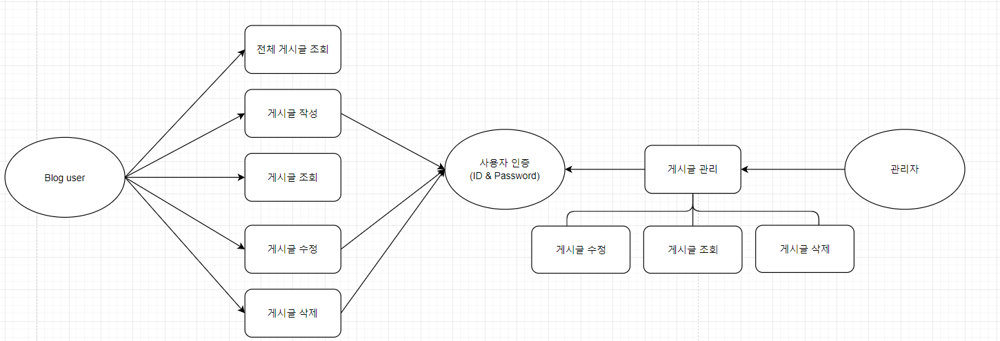
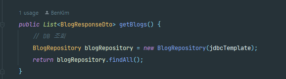
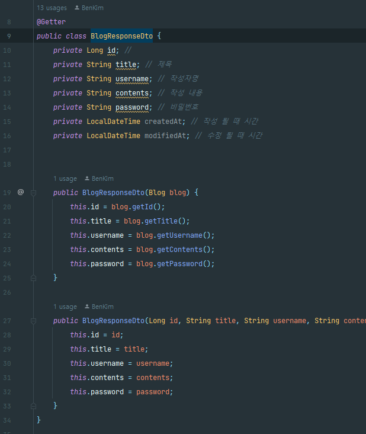

# SpringAssignment

**6월 18일까지의 Commit Push 진행상황**

1.아래의 요구사항을 기반으로 Use Case 그려보기
usecase를 그려보았지만 아직 Use Case를 그려봄에 있어서 정확한 방향을 잘 모르겠습니다.

2. 전체 게시글 목록 조회 API
    - 제목, 작성자명, 작성 내용, 작성 날짜를 조회하기 -> 비즈니스 로직을 담당하는 Service 패키지의 클래스에 구현되었습니다.
   
    - 작성 날짜 기준 내림차순으로 정렬하기 -> 추가적으로 구현하여 커밋 푸쉬 예정입니다.
   
3. 게시글 작성 API
    - 제목, 작성자명, 비밀번호, 작성 내용을 저장 -> password를 Collumn DB에 추가하긴 했으나 기본 null값으로 하고 있습니다. index.html에서 구현된게 Password랑 Title을 입력이 구현이 안되어서 null값으로 넣어놨습니다.
   
    - 저장된 게시글을 Client 로 반환하기 -> Api형식으로 반환하였습니다.

4. 선택한 게시글 조회 API
    - 선택한 게시글의 제목, 작성자명, 작성 날짜, 작성 내용을 조회하기 -> 추후 구현 예정 (id값 & pw 일치할 경우 해당 blog의 title, username, createdAt, contents 출력)
      (검색 기능이 아닙니다. 간단한 게시글 조회만 구현해주세요.)
   
5. 선택한 게시글 수정 API
    - 수정을 요청할 때 수정할 데이터와 비밀번호를 같이 보내서 서버에서 비밀번호 일치 여부를 확인 한 후 -> 추후 구현 예정 (id * pw 일치할 경우 수정후 client에 반환)
    - 제목, 작성자명, 작성 내용을 수정하고 수정된 게시글을 Client 로 반환하기
   
6. 선택한 게시글 삭제 API
    - 삭제를 요청할 때 비밀번호를 같이 보내서 서버에서 비밀번호 일치 여부를 확인 한 후 -> 추후 구현 예정 (id * pw 일치할 경우 수정후 client에 반환)
    - 선택한 게시글을 삭제하고 Client 로 성공했다는 표시 반환하기

전체적으로 강의에서 배웠던 CRUD 기능은 jdbctemplate으로 구현이 되었습니다. 추후 JPA 기반으로 추가를 할 예정입니다.
추가 및 수정 목록 
1. JPA기반 구현
2. 게시글 조회 & 수정 & 삭제 id & pw 값을 받아서 수정 후 Client에게 반환 구현
3. 작성 날짜 Collumn 추가

질문 내용
1. 사실 SpringBoot를 이해하지 못해서 1주차 강의부터 다시 천천히 들으면서 따라서 구현을 했습니다. 스스로 구현했다기 보다 따라서 보고 만들었다는 쪽에 가깝습니다.
RESTful한 blog 페이지를 만들고 싶지만, 과제를 받았을 때 어디서부터 구현해야 할지 몰라서 우선 이 방법으로 최대한 하였습니다.
이렇게라도 과제를 완성하는 방향이 옳은지, 혹은 다른 더 좋은 방향으로 과제 및 학습을 해나갈 수 있다면 알려주시면 정말 감사하겠습니다..!

2. ID가 현재 Primary키로 되어있어서 현재까지의 코드는 ID 값을 받아서 조회, 수정, 삭제 기능을 하고있습니다. 과제는 ID와 PW 값이 일치할 경우 실행되고 Client에 반환을 하는것이 과제입니다.
여기서 궁금한 점은 어떻게 해야 PW도 ID와 같이 기능을 함께 추가시킬 수 있을지 머릿속으로 잘 떠오르지 않습니다. PW가 Primary Key가 아니여도 값을 받은 후 Client에 반환할 수 있는 걸까요?

이번 과제는 Java의 개념이 부족한 상태에서 Spring 과제를 강의를 보고 최대한 CRUD구현이라도 해보자는 목표로 진행하였습니다.
질문 1과 같지만 튜터님께서 혹시 이렇게라도 학습을 해 나가는게 나은지 다른 방향으로 학습을 하는게 좋을 것 같으면 말씀을 남겨주시면 감사하겠습니다.